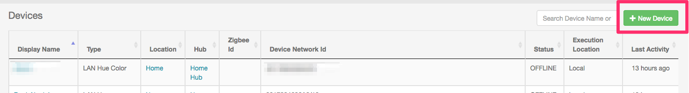
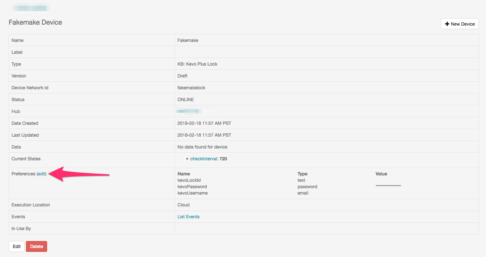
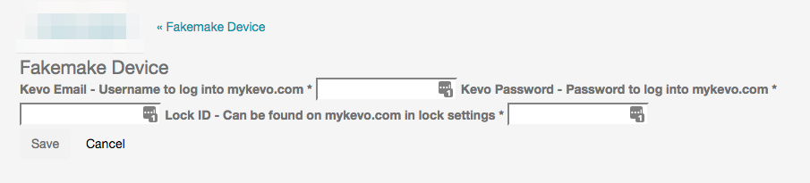

# kevo-unofficial
An unofficial Kevo (Plus) device handler for SmartThings

## Intro
This is a device handler definition for Kevo Plus locks.  You'll need to clone and setup the device handler before setting up the devices.

## Setup Instructions

1. Go to your devices list, and create a new device

 
2. Fill out a name, network id, etc.
 
3. Click on Type and scroll to the bottom until you see the Kevo Unofficial and select that

  
4. After saving, go back to the Device List

5. Find and click edit next to your device

6. Click on edit next to the now available Preferences section

7. Fill in the username, password, and the device information from Kevo.

8. Hit Save.  You should now have a "Thing" available for control.